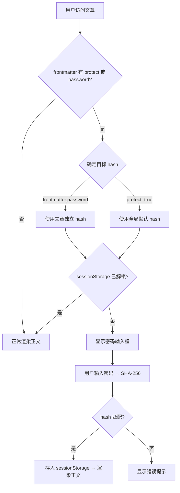

## 替代方案对比

在动手实现之前，先了解有哪些可选方案，选择最适合你的：

| 方案 | 安全性 | 实现复杂度 | 是否依赖平台 | 适用场景 |
|------|--------|-----------|-------------|---------|
| **本文方案（客户端 hash）** | ★☆☆☆☆（防君子） | 低 | 否 | 个人站点、非敏感内容 |
| Cloudflare Access / Vercel Password | ★★★☆☆ | 低 | 是 | 已使用对应平台、需要账号级保护 |
| 构建时 AES 加密（remark 插件） | ★★★★☆ | 高 | 否 | 需要真保护、可接受额外复杂度 |
| `docusaurus-plugin-password-protect` | ★★☆☆☆ | 低 | 否 | 不想手写、需求与插件匹配 |


## 实现思路

### 密码校验流程



### 为什么存 hash 不存明文

密码会打进客户端 JS bundle 和 git 仓库。存 SHA-256 hash 避免密码直接暴露。不过 hash 仅防止"一眼看到密码"，不能防 hash 碰撞或彩虹表攻击——这个场景下够用。

### sessionStorage 解锁粒度

以 hash 为 key 存解锁状态。同一会话内，相同 hash 的文章解锁一次即可，不重复输入。关闭浏览器标签页后解锁状态自动清除。

## 实现步骤

### 1. 配置全局默认密码

在 `docusaurus.config.js` 中新增 `customFields.globalPasswordHash`：

```js title="docusaurus.config.js"
customFields: {
  // 全局默认密码的 SHA-256 hash
  // 修改密码：echo -n "你的密码" | shasum -a 256
  globalPasswordHash: "057ba03d6c44104863dc7361fe4578965d1887360f90a0895882e58a6248fc86",
},
```

生成 hash：

```bash
echo -n "changeme" | shasum -a 256
# 输出: 057ba03d6c44104863dc7361fe4578965d1887360f90a0895882e58a6248fc86
```

### 2. Swizzle DocItem/Content 组件

Docusaurus 的 [swizzle](https://docusaurus.io/docs/swizzling) 机制允许覆盖主题组件。这里 eject `DocItem/Content`——正文渲染的入口组件。

```bash
npx docusaurus swizzle @docusaurus/theme-classic DocItem/Content --eject
```

:::note
交互式命令在非 tty 环境下无法选择语言和确认。可以手动创建文件到 `src/theme/DocItem/Content/index.js`，Docusaurus 会自动识别 swizzled 组件。
:::

### 3. 密码保护组件

新建 `src/components/PasswordProtect.js`：

```jsx title="src/components/PasswordProtect.js"
import React, {useState, useCallback} from 'react';

const styles = {
  container: {
    display: 'flex',
    flexDirection: 'column',
    alignItems: 'center',
    justifyContent: 'center',
    minHeight: '200px',
    padding: '2rem',
    textAlign: 'center',
  },
  title: {
    fontSize: '1.5rem',
    fontWeight: 600,
    marginBottom: '0.5rem',
  },
  hint: {
    fontSize: '0.9rem',
    opacity: 0.7,
    marginBottom: '1.5rem',
  },
  inputRow: {
    display: 'flex',
    gap: '0.5rem',
    width: '100%',
    maxWidth: '360px',
  },
  input: {
    flex: 1,
    padding: '0.5rem 0.75rem',
    fontSize: '1rem',
    border: '1px solid var(--ifm-color-emphasis-300)',
    borderRadius: '4px',
    background: 'var(--ifm-background-color)',
    color: 'var(--ifm-font-color-base)',
    outline: 'none',
  },
  button: {
    padding: '0.5rem 1.25rem',
    fontSize: '1rem',
    border: 'none',
    borderRadius: '4px',
    background: 'var(--ifm-color-primary)',
    color: '#fff',
    cursor: 'pointer',
    whiteSpace: 'nowrap',
  },
  error: {
    color: 'var(--ifm-color-danger)',
    fontSize: '0.85rem',
    marginTop: '0.75rem',
  },
};

async function sha256(text) {
  const encoder = new TextEncoder();
  const data = encoder.encode(text);
  const hashBuffer = await crypto.subtle.digest('SHA-256', data);
  const hashArray = Array.from(new Uint8Array(hashBuffer));
  return hashArray.map((b) => b.toString(16).padStart(2, '0')).join('');
}

function getUnlockedHash(hash) {
  try {
    return sessionStorage.getItem(`galaxy-unlocked-${hash}`) === '1';
  } catch {
    return false;
  }
}

function setUnlockedHash(hash) {
  try {
    sessionStorage.setItem(`galaxy-unlocked-${hash}`, '1');
  } catch {
    // sessionStorage 不可用时静默失败
  }
}

export default function PasswordProtect({passwordHash, children}) {
  const [unlocked, setUnlocked] = useState(() => getUnlockedHash(passwordHash));
  const [inputValue, setInputValue] = useState('');
  const [error, setError] = useState('');

  const handleUnlock = useCallback(
    async (e) => {
      e.preventDefault();
      const inputHash = await sha256(inputValue);
      if (inputHash === passwordHash) {
        setUnlockedHash(passwordHash);
        setUnlocked(true);
        setError('');
      } else {
        setError('密码错误，请重试');
      }
    },
    [inputValue, passwordHash],
  );

  if (unlocked) {
    return <>{children}</>;
  }

  return (
    <div style={styles.container}>
      <p style={styles.title}>🔒 此文章需要密码访问</p>
      <p style={styles.hint}>请输入密码以查看正文内容</p>
      <form onSubmit={handleUnlock} style={styles.inputRow}>
        <input
          type="password"
          value={inputValue}
          onChange={(e) => setInputValue(e.target.value)}
          placeholder="请输入密码"
          style={styles.input}
          autoFocus
        />
        <button type="submit" style={styles.button}>
          解锁
        </button>
      </form>
      {error && <p style={styles.error}>{error}</p>}
    </div>
  );
}
```

### 4. 修改 DocItem/Content 集成密码保护

在 swizzled `src/theme/DocItem/Content/index.js` 中，读取 frontmatter 判断是否需要保护，并在需要时将正文包裹在 `PasswordProtect` 组件内。完整代码如下：

```jsx title="src/theme/DocItem/Content/index.js"
import React from 'react';
import clsx from 'clsx';
import {ThemeClassNames} from '@docusaurus/theme-common';
import {useDoc} from '@docusaurus/plugin-content-docs/client';
import useDocusaurusContext from '@docusaurus/useDocusaurusContext';
import Heading from '@theme/Heading';
import MDXContent from '@theme/MDXContent';
import PasswordProtect from '@site/src/components/PasswordProtect';

function useSyntheticTitle() {
  const {metadata, frontMatter, contentTitle} = useDoc();
  const shouldRender =
    !frontMatter.hide_title && typeof contentTitle === 'undefined';
  if (!shouldRender) {
    return null;
  }
  return metadata.title;
}

function usePasswordHash() {
  const {frontMatter} = useDoc();
  const {siteConfig} = useDocusaurusContext();

  // 文章级独立密码（SHA-256 hash）
  if (frontMatter.password) {
    return frontMatter.password;
  }

  // 使用全局默认密码
  if (frontMatter.protect === true) {
    return siteConfig.customFields?.globalPasswordHash ?? null;
  }

  return null;
}

export default function DocItemContent({children}) {
  const syntheticTitle = useSyntheticTitle();
  const passwordHash = usePasswordHash();

  const content = (
    <div className={clsx(ThemeClassNames.docs.docMarkdown, 'markdown')}>
      {syntheticTitle && (
        <header>
          <Heading as="h1">{syntheticTitle}</Heading>
        </header>
      )}
      <MDXContent>{children}</MDXContent>
    </div>
  );

  if (passwordHash) {
    return (
      <PasswordProtect passwordHash={passwordHash}>
        {content}
      </PasswordProtect>
    );
  }

  return content;
}
```

## 使用方法

### 全局默认密码

修改 `docusaurus.config.js` 中 `customFields.globalPasswordHash`：

```bash
echo -n "你的密码" | shasum -a 256
```

### 文章级保护

两种模式：

```md title="使用全局默认密码"
---
title: 私密文章
protect: true
---
```

```md title="使用独立密码"
---
title: 私密文章
password: ecd71870d1963316a97e3ac3408c9835ad8cf0f3c1bc703527c30265534f75ae
---
```

生成文章独立密码的 hash：

```bash
echo -n "test123" | shasum -a 256
# 输出: ecd71870d1963316a97e3ac3408c9835ad8cf0f3c1bc703527c30265534f75ae
```

## 边缘情况与注意事项

### sessionStorage 不可用

部分浏览器隐私模式或特殊环境下 `sessionStorage` 可能不可用。代码中已用 `try-catch` 包裹，不可用时用户每次访问都需要重新输入密码，不会报错。

### crypto.subtle 兼容性

`crypto.subtle.digest` 是 Web Crypto API，主流浏览器均支持，但仅在 HTTPS 或 localhost 环境下可用。Galaxy 部署在 Cloudflare Pages（自带 HTTPS），无需额外处理。

### 密码修改后旧会话的状态

修改 hash 后，老用户 sessionStorage 里存的仍是旧 hash，不会自动失效。如需强制重新验证，可以在 hash key 末尾加版本号（如 `galaxy-unlocked-${hash}-v2`），或者通知用户清除浏览器缓存。

### SSG HTML 包含完整内容

纯静态站点在构建时生成完整 HTML（包含正文），客户端 React hydration 后才隐藏内容。这意味着搜索引擎爬虫和查看源码的用户能看到正文。这是软保护方案的固有限制，个人站点可接受。如需真保护，请参考上文的[替代方案对比](#替代方案对比)。

## 踩坑记录

### 文件名以 _ 开头会被 Docusaurus 忽略

测试时把测试文件命名为 `_password-test.md`，构建后发现页面 404。Docusaurus 约定以 `_` 开头的 markdown 文件是 partial/draft，不会被路由系统收录。改为正常文件名即可。

### swizzle 交互式命令在非 tty 环境失败

`npx docusaurus swizzle` 需要交互式选择语言（JavaScript/TypeScript）和确认危险操作。在非 tty 环境（如 CI 或管道输入）下会卡住。解决方式是直接手动创建文件到 `src/theme/DocItem/Content/index.js`，效果与 swizzle eject 相同。

## 验证结果

| 测试项 | 结果 |
|--------|------|
| `protect: true` 文章，输入全局密码解锁 | ✅ |
| `password` 文章，输入独立密码解锁 | ✅ |
| 错误密码显示"密码错误，请重试" | ✅ |
| 同会话同 hash 自动解锁，不重复输入 | ✅ |
| 公开文章无密码 UI，正常渲染 | ✅ |
| Blog 不受影响 | ✅ |
| 侧边栏显示受保护文章标题 | ✅ |
| `npm run build` 通过 | ✅ |
