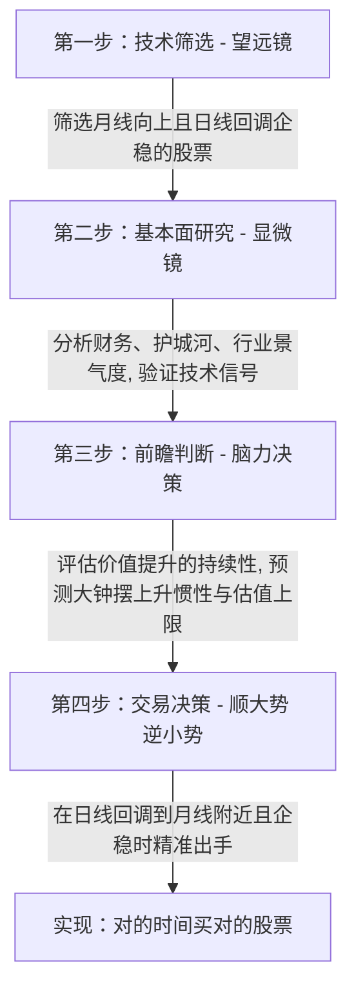
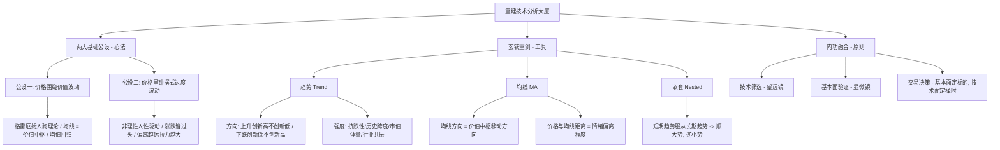

# K线技术分析

## 1. 核心概念与定义 (Core Concepts)

为了建立科学的投资认知，必须首先厘清技术分析在不同时代背景下的本质定义，并剔除过时的认知噪音。

| 核心术语 | 专业定义与内涵解释 |
| :--- | :--- |
| **量化投资 1.0**<br />(史前量化阶段) | **传统技术分析的本质**。在无计算机时代，依靠交易员肉眼识别价格图表（如K线形态、道氏理论、酒田战法），人工归纳历史数据中可重复出现的统计学模式。其本质是**基于人脑识别、手工运行的初级量化策略**。 |
| **量化投资 2.0**<br />(计算机辅助阶段) | 20世纪70-80年代，利用计算机进行数据计算，将模糊的形态归纳转化为精确的数学指标计算（如 MACD, KDJ, RSI）。此阶段只是**将人脑的计算工作移交给了电脑**。 |
| **真·量化投资**<br />(算法降维打击阶段) | 20世纪90年代至今，顶尖量化基金（如 Renaissance, AQR, D.E. Shaw）利用超级计算机和AI，在微秒级别对海量维度数据（价格、基本面、新闻、天气等）进行多因子回测与高频交易。该阶段通过**瞬间套利**彻底抹平了显而易见的简单指标超额收益。 |
| **均值回归原理**<br />(Mean Reversion) | 金融学基本规律。价格（Dog）短期内因情绪偏离价值中枢（Man），但受制于内在价值规律的约束（Leash），最终必然向价值中枢收敛的现象。 |
| **趋势 (Trend)** | 价格运动的方向（趋）与强度（势）的结合。其本质是**基本面价值变化的图表映射**：<br />- **上升趋势**：$H_t > H_{t-1}$（创新高）且 $L_t > L_{t-1}$（不创新低），代表价值中枢上移。<br />- **下跌趋势**：$H_t < H_{t-1}$（不创新高）且 $L_t < L_{t-1}$（创新低），代表价值中枢下移。 |
| **钟摆嵌套结构**<br />(Nested Pendulums) | 市场趋势的多时间级别（日线、周线、月线、年线）复合运动。大级别钟摆决定大方向（大势），小级别钟摆决定短期波动（小势）。**短期趋势最终服从长期趋势**。 |

---

## 2. 核心内容详细拆解 (Detailed Breakdown)

### 2.1 传统技术分析的演进与失效机制

传统技术分析（K线、指标、玄学理论）在现代高频量化时代已基本失效，其传导逻辑与失效路径如下：

#### ① 历史起源：信息荒漠中的天才归纳
- **时代背景**：19世纪末20世纪初，无互联网、无即时财报，价格和粗略成交量是唯一实时且公平的数据。
- **代表理论**：东方的**酒田战法**（日本米市蜡烛图技术）、西方的**道氏理论**。
- **逻辑局限**：在信息匮乏时代，用人脑识别"头肩顶"、"金叉"等模式是顶尖的数据科学；但在信息爆炸与高算力时代，这种手工归纳已沦为效率极低的"算盘"。

#### ② 现代量化算法的降维打击机制
- **套利逻辑**：
  $$\text{简单技术模式（如MACD金叉）有效} \longrightarrow \text{超级计算机瞬间识别} \longrightarrow \text{高频算法疯狂套利} \longrightarrow \text{超额收益（Alpha）消失}$$
- **残酷现实**：散户用肉眼寻找K线形态，其对手是几千台超级计算机在微秒级别收割利润。教科书上公开流传的指标与形态，其唯一能被公开的原因是**它们已经失效了**。

---

### 2.2 重建技术分析：两大物理级公设

在传统技术分析的废墟上，可以通过两条最基础的公设，推导出技术分析在后计算机时代的正确定位——**追踪和衡量，而非预测未来**。

```
【公设一：价格波动围绕价值】 (格雷厄姆"人与狗"理论)
  - 人 = 价值 (核心，决定进退方向)
  - 狗 = 价格 (表象，忽前忽后)
  - 绳 = 价值规律 (约束狗不能无限偏离)
  - 均线 = 价值中枢 (人的步行轨迹模糊投影)
```
$$\Downarrow$$
```
【公设二：价格的钟摆式过度摆动】
  - 动能来源 = 非理性人性 (贪婪追涨、恐慌杀跌)、羊群效应、信息不对称
  - 物理特征 = 价格运动是非线性的，必定涨过头/跌过头
  - 回归机制 = 偏离静止点（内在价值）越远，回归的拉力越强
```

#### 技术分析的现代正确定位：
技术分析不具备预测功能，它是一个**仪表盘**，用于回答三个衡量性问题：
1. **位置**：价格偏离价值中枢（长周期均线）有多远？（偏离度）
2. **方向**：钟摆当前朝哪个方向摆动？（趋势）
3. **情绪**：钟摆是否已摆动至极端位置？（超买/超卖）

---

### 2.3 玄铁剑法核心：趋势、均线与嵌套

放弃繁复的形态学与衍生指标，只保留最质朴的"趋势"与"均线"。

#### ① 趋势的判定与"势"的衡量
- **方向（趋）**：
  - **上升趋势**：人在上山，均线上移。利用短期波动逆势做多。
  - **下跌趋势**：人在下山，均线下移。避开或利用反弹做空。
  - **震荡趋势**：能量耗尽，价格反复穿越均线。**不进行任何交易**。
- **强度（势）**：
  - **抗跌性**：大盘大跌而个股不跌甚至逆势上涨（势大）。
  - **时间跨度**：历史长期持续上涨的股票，其惯性强于短期暴涨股（势大）。
  - **体量属性**：大盘股上涨需更大资金量推动，不易被操纵，信号更可靠（势大）。
  - **板块共振**：行业板块、产业链上下游集体起势，强度极高（势大）。

#### ② 移动平均线（MA）的本质
移动平均线是特定周期内的平均价格，代表**市场对价值的平均共识（价值中枢）**。
- **功能一（看方向）**：均线向上，基本面改善，价值共识抬升；均线走平，价值稳定；均线向下，基本面恶化。
- **功能二（看偏离）**：价格远高于均线，代表过度乐观（拉力增强，有回调压力）；价格远低于均线，代表过度悲观（拉力增强，有反弹动力）。
> *注：MACD 的红绿柱本质上是价格与均线距离的变体，KDJ 的超买超卖则是偏离度的另一种计算。直接看均线即可，无需套用衍生指标。*

#### ③ 核心战术：顺大势，逆小势
基于钟摆嵌套结构（短期趋势服从长期趋势）：
- **大势**：长周期趋势（如月线、年线），代表长期价值方向。**必须选择月线或年线昂首向上的股票（顺大势）**。
- **小势**：短周期趋势（如日线、周线），代表短期情绪波动。
- **交易逻辑**：在大钟摆（月线）向上的惯性中，等待小钟摆（日线）因短期恐慌回调至大钟摆支点（月线）附近。

$$\text{月线趋势向上} + \text{日线回调至月线附近} + \text{小钟摆企稳回摆} \implies \text{建仓良机}$$

---

### 2.4 内功（基本面）与招式（技术面）的系统融合

> **"内功为本，招式为辅。技术分析必须服从基本面分析。"**

技术分析的致命局限在于**它只能看到"狗"（价格）和"绳"（均线），看不到"人"（基本面）的健康状况**。如果基本面发生突变（如财务造假、行业倾覆），"人"会突然掉头或猝死，技术图表将瞬间失效。

#### 完整的四步投资流程：



1. **第一步：技术筛选（望远镜）**：从几千只股票中，快速筛选出大趋势向上（月线向上）、且小钟摆回摆（日线回调接近月线）的标的，缩小研究范围。
2. **第二步：基本面研究（显微镜）**：研究均线上移的底层驱动力，确保不是概念炒作，排除基本面雷区（如负债暴雷、伪造业绩）。
3. **第三步：前瞻判断（内功+招式结合）**：评估企业价值提升能持续多久，判断大钟摆向上的惯性边界，寻找合理的估值上限。
4. **第四步：交易决策（择时出手）**：基本面决定"买什么"（内功），技术面决定"何时买"（招式）。在日线回调企稳、情绪冰点时建仓。

---

## 3. 逻辑脑图提炼 (Mindmap & Summary)

### 3.1 核心结论（Golden Quotes）

> "如果把投资比作练武功，分析基本面、研究公司价值，这叫内功；看K线看价格，这叫招式。这个世界上，绝大多数人都在犯一个致命的错误：他们内功为零，却痴迷于学习最华丽的招式。"

> "你所痴迷的那些K线形态和技术指标，是量化投资1.0的产物。它们之所以在教科书上流传，唯一的原因是因为它们已经失效了。真正有效的模式，是量化基金的最高机密，你永远不可能知道。"

> "技术分析的全部作用，就是追踪价格相对价值的过度波动周期。它不是预测未来的巫术，而是追踪现状的仪表盘。"

> "顺大势，逆小势。在大钟摆向上的惯性中，去接小钟摆向下的底部。"

---

### 3.2 范式转换对照表：巫术 vs 真理

| 维度 | 过时的巫术 (量化 1.0) | 科学的真理 (玄铁重剑) |
| :--- | :--- | :--- |
| **研究对象** | K线形态、早晨之星、波浪理论、江恩理论、指标交叉。 | 价格波动围绕价值的路径、钟摆过度的空间。 |
| **思维逻辑** | 试图通过历史价格形态**预测**未来短期走势。 | 通过均线与趋势，**衡量和追踪**价格与价值的偏离度。 |
| **指标工具** | 调节 KDJ/MACD 参数，迷信黄金交叉。 | **趋势**（高低点判定） + **均线**（移动的价值中枢）。 |
| **操作行为** | 追逐高频交易，在震荡市或下跌市频繁试错。 | **顺大势、逆小势**。利用短期恐慌，在长期均线附近建仓。 |
| **核心支撑** | 无内功，纯看图。 | 80% 精力用于**基本面研究**，20% 辅助图表择时。 |

---

### 3.3 知识架构脑图 (Mermaid)


