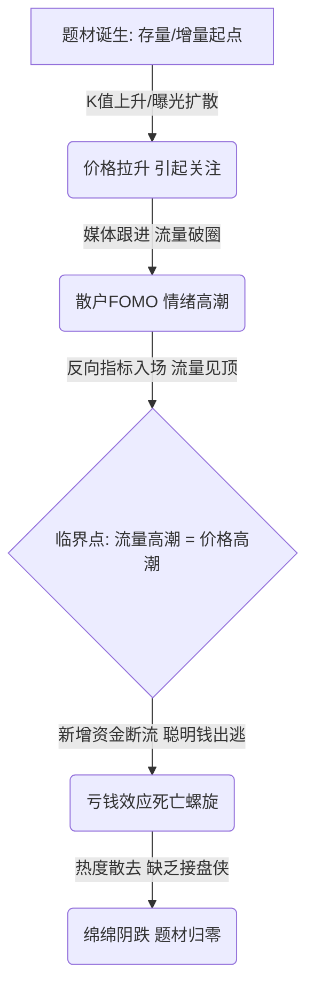

# Meme Coin 与 A股热点炒作的流量定价模型

## 1. 核心概念与定义 (Core Concepts)

在非理性繁荣的投机市场（如币圈 Meme Coin、A股题材股）中，传统的**现金流折现模型 (DCF)** 失去效用。本文基于**互联网流量思维**与**行为金融学**，重新定义了以下核心概念：

- **投机流量模型 (Speculative Traffic Model)**：一种将互联网电商运营公式跨界引入金融估值的模型。该模型认为，无基本面支撑的投机标的，其价格天花板由**新增接盘流动性总量**决定，而流动性由曝光、转化及散户资金量共同塑造。
- **共识溢价 (Consensus Premium)**：源于"共识即价值"的观点。在投机市场中，即使标的物无实际资产抵押或现金流，只要足够多的市场参与者对其产生共同的行为预期，就能通过流动性自我实现而产生价格溢价。
- **病毒系数 (K-Value / Viral Coefficient)**：源于互联网增长黑客理论。在增量流量型炒作中，指**平均每个既有投资者能够吸引并转化新投资者的数量**。
- **存量流量型题材 (Stock Traffic Theme)**：指本身自带顶级流量属性、无需长时间发酵、曝光量瞬间见顶的题材（如名人效应、国家级突发政策）。
- **增量流量型题材 (Incremental Traffic Theme)**：指初始流量较小，但具备高传染性，通过社群、情绪共鸣和造富效应呈指数级分裂传播的题材。
- **反向指标圈层 (Terminal Contrarian Indicator)**：指市场中信息最滞后、认知和专业度最低、跟风意图最强的极末端群体。当该群体入场时，通常意味着市场新增流量已彻底枯竭。

---

## 2. 核心内容详细拆解 (Detailed Breakdown)

### 2.1 投机市场的底层估值公式：流量定价法

在纯筹码博弈的投机市场中，标的物的天花板估值并非取决于其内在价值，而是取决于**接盘流动性的总量**。

#### 核心公式推导
电商基本公式：
$$GMV = \text{流量} \times \text{转化率} \times \text{客单价}$$

降维引入投机市场，演化为**题材炒作天花板公式**：
$$\text{题材炒作高度} = \frac{\text{流量规模} \times \text{转化率} \times \text{客单价}}{\text{板块总盘子}} \times \text{竞品分流折扣}$$

#### 变量深度剖析
1. **流量规模（曝光量）**：指有多少市场参与者看到了该题材的信息。
2. **转化率（SB 浓度）**：指在接收到信息的人群中，有多少比例的人会产生 FOMO（恐慌性买入）情绪并实际下单。
3. **客单价（单户资金）**：指散户平均每个账户能够投入该题材的资金量。
4. **板块总盘子（分母修正）**：标的板块的总市值与流通盘大小。盘子过大则难以拉动，盘子过小则无法承载大资金（游资）建仓。
5. **竞品分流折扣（注意力稀缺度）**：市场同时存在的竞争题材数量。由于散户注意力是稀缺资源，多题材并存会产生分流。

---

### 2.2 两种流量类型的演化路径与节奏

根据流量的产生和传播方式，题材可分为以下两类，其操作节奏截然不同：

```
【存量流量型】 曝光爆发 ──► 极速见顶 ──► 窗口期短（手快吃肉，手慢接盘）
【增量流量型】 初始微小 ──► 指数裂变 ──► 窗口期长（多波段、适合埋伏）
```

#### A. 存量流量型（自带顶流）
- **传导机制**：
  $$\text{顶流/政策发布} \longrightarrow \text{主流媒体/社交热搜瞬间霸屏} \longrightarrow \text{亿级曝光一次性到位} \longrightarrow \text{短期内资金极速博弈}$$
- **典型案例**：
  - **特朗普发币**：利用全球顶级政治人物的存量粉丝和媒体关注度，曝光瞬间拉满，获利空间在于全球不同时区、不同层级人群接收信息的"时间差"。
  - **DeepSeek 概念**：中国自研 AI 技术的突破，叠加"国家民族情绪"Buff，央视、抖音霸屏，形成全民讨论，短期内吸引巨大资金，随后快速出货。
- **特点**：来得快去得快，生命周期极短，容错率低，需要极快的执行力。

#### B. 增量流量型（病毒裂变）
- **传导机制**：
  $$\text{初始极小圈子} \longrightarrow \text{低门槛叙事（蹭热度/模因）} \longrightarrow \text{早期参与者炫耀性传播} \longrightarrow \text{FOMO 效应扩散} \longrightarrow \text{圈外资金合流}$$
- **典型案例**：
  - **SHIB (柴犬币)**：以"DOGE 杀手"为叙事，柴犬形象无认知门槛，通过推特裂变，市值从百万美元裂变至最高 300 多亿美元。
  - **比特币早期**：通过"数字黄金"、"对抗法币通胀"等高感染力叙事降低极客技术的理解门槛，实现全球自发传教。
- **决定性指标：病毒系数 $K$**
  - $K > 1.5$：指数型爆发，行情具有极强的持续性。
  - $K \approx 1.0$：线性温和增长。
  - $K < 1.0$：热度快速衰减，项目走向归零。
- **快速研判法（自问双规）**：
  1. *我是否会主动把这个题材/Meme 转发给他人？*
  2. *我的朋友看到后，是否会产生购买冲动？*
  （若两问皆为"是"，则 $K$ 值极高，具备暴涨潜力）。

---

### 2.3 不同金融市场的结构差异对比

为什么美股极少出现 A股和币圈这种纯粹基于筹码和流量的无逻辑炒作？

| 维度 | A股 (A-Shares) | 币圈 (Crypto) | 美股 (US Stock) |
| :--- | :--- | :--- | :--- |
| **主导力量** | **散户主导**（持股市值占比30-40%，但**交易量占比达 70% 以上**） | **散户/投机客绝对主导** | **机构主导**（持股占比 70% 以上） |
| **决策依据** | 政策、抖音热搜、雪球、自媒体、小道消息 | Twitter (X)、Telegram、社区群聊、KOL 喊单 | 彭博终端、公司财报、行业深度调研、基本面 |
| **信息流特征** | **高度集中**（央视、新闻联播、抖音热点，易形成全民共振） | **局部高度集中**（马斯克、Vitalik 等头部 KOL 拥有绝对定义权） | **高度分散**（信息源分流：彭博、CNBC、Reddit 各自为政，难以共振） |
| **做空制约** | **极弱**（融券标的稀缺、费率高昂，缺乏有效做空机制） | **链上阶段无做空**，无法在早期通过做空纠偏 | **极强**（做空机制发达、借券成本低，无涨跌停限制，量化套利迅速） |
| **价格表现** | 系统性题材炒作、板块集体涨停潮 | Meme 币满天飞、动辄百倍千倍、流动性溢出 | 极少出现无基本面炒作（除 GME 等极少数反建制运动外） |

---

### 2.4 逃命时刻：流量见顶与价格见顶的同步性

投机市场本质是**击鼓传花的庞氏博弈**，价格的拉升需要持续的新增流量提供资金流（即退路）。

#### 正负反馈螺旋
```
【正反馈（上涨期）】
价格拉升 ──► 吸引眼球 ──► 媒体跟进（热度破圈） ──► 散户 FOMO 入场 ──► 资金推高价格

【拐点（见顶）】
流量触达最末端（无后续新增资金） ──► 早期资金开始止盈 ──► 承接力衰竭

【负反馈（下跌期）】
热度下降 ──► 亏钱效应显现 ──► 割肉盘涌出 ──► 破位下跌 ──► 流量彻底归零
```

#### 流量见顶实用监测指标
1. **A股市场监测**：
   - **抖音热搜**：观察题材的排名，尤其是**评论数的环比增速**。若增速放缓或下滑，无脑出货。
   - **雪球/股吧**：监控龙头标的股吧中**每分钟发帖量**及**新用户（新面孔）发言占比**。
   - **主流媒体（央视）**：首次报道为利好，深入连续报道为高潮（见顶信号），停止报道则是冰点。
   - **龙虎榜**：早期为著名游资（聪明钱）建仓，中期混战，晚期若全是散户大本营（拉萨天团等营业部）接盘，则立刻撤退。
2. **币圈市场监测**：
   - **社群热度**：微信群、Telegram/Discord 的发言频率放缓，普通群友都在询问如何购买时，即是高潮。
   - **链上数据**：新增持币地址数的**日环比增速拐点**。若地址增速放缓，而钱包向交易所大额转账增加，说明主力准备砸盘。
   - **盘口深度**：CEX（中心化交易所）中买盘（Bid）深度变薄，卖盘（Ask）挂单变厚。
3. **终极反向指标：擦鞋童理论（Shoeshine Boy Effect）**
   - 当流量扩散到市场上**认知度最低、投机性最强、信息最滞后**的圈层（如1929年美股崩盘前的擦鞋童，或生活中的大妈、完全不涉足金融的亲友）开始谈论该标的时，说明后续新增 SB 流量已归零，必须立刻清仓。

---

### 2.5 标的选择：眼球竞争法则

> **核心结论**：龙头股不一定是因果逻辑最纯正的，但一定是**辨识度最高、最容易被散户发现和记住的**。

- **法则一：先涨为王（心智占领）**
  散户习惯通过"涨幅榜"作为获取信息的流量入口。率先封板、涨幅第一的标的将天然获得全市场的聚光灯，后续跟风者即使基本面再正宗也只能沦为配角。
- **法则二：名字最重要（极简转化）**
  互联网思维的核心是"每减少一步操作，转化率提升一倍"。标的名字与热点事件直接挂钩（如：特朗普当选 vs 川大智胜；DeepSeek 爆发 vs 名字直接带有 AI/算力关联的代码），能缩短散户的搜索和决策路径。
- **法则三：龙头的分化与溢出效应**
  - **A股（因涨停限制，分化较温和）**：龙一吃肉，龙二、龙三依靠涨停板曝光效应仍可"喝汤"。
  - **币圈（马太效应极致放大）**：由于没有涨停限制且信息流极度集中，**龙一通常独占 99% 的资金与流量**，龙二以下极易直接归零。
  - **例外（流动性溢出）**：若龙一市值过高、涨速过快，资金盘子无法承载涌入的散户资金，资金会溢出到龙二。或不同交易所因争夺流量，刻意在自家平台上扶持不同的龙二（如 Binance 与 OKX 的龙头之争）。
- **法则四：KOL 的"造龙权"**
  流量话语权即是印钞权。无论是当年的"宁波敢死队"通过封板吸引眼球，还是如今直播间投顾、自媒体大 V 联合高呼，本质都是利用自身掌握的流量入口，人为制造并定义"龙头"，随后在高位将筹码派发给跟风散户。

---

## 3. 逻辑脑图提炼 (Mindmap & Summary)

### 3.1 核心理论

> "SB 的共识，也是共识。只要有足够多的 SB 愿意接盘，这个东西就能炒起来。"

> "投机市场就是流量生意。流量在哪里，资金就在哪里。价格高潮跟流量高潮，基本上是同步发生的。"

> "逻辑最硬、基本面最好的不一定是龙头，抢到眼球的才是龙头。"

> "无论是币圈的玩家，还是 A股的游资，核心做的事情，都是在用互联网思维对热点进行定价。"

---

### 3.2 炒作全周期流量-价格博弈图

以下展示了投机题材从启动到消亡的典型生命周期：



---

### 3.3 投机选手的"高阶心法"（知行合一的3大天生能力）

拥有定价框架只是入场券，真正决定投机者生死的是以下三种难以通过后天简单训练改变的"神经系统特质"：

```
                              ┌──► 1. 极端不确定性耐受度 ──► 仓位上去后，身体不先投降，敢于拿住龙头
                              │
【真正决定投机上限的特质】 ───┼──► 2. 对错失机会（FOMO）的免疫力 ──► 踏空后毫无情绪波动，不急于挽回
                              │
                              └──► 3. 将博弈视为纯粹的概率执行 ──► 放弃"自我证明"的执念，不对抗市场，该割肉时绝不手软
```

* **寄语**：投机是一门刀口舔血的"邪修功夫"。如果评估自己不具备上述三种天生的神经系统特质，踏踏实实做价值投资与产业研究，才是生存率更高的道路。
