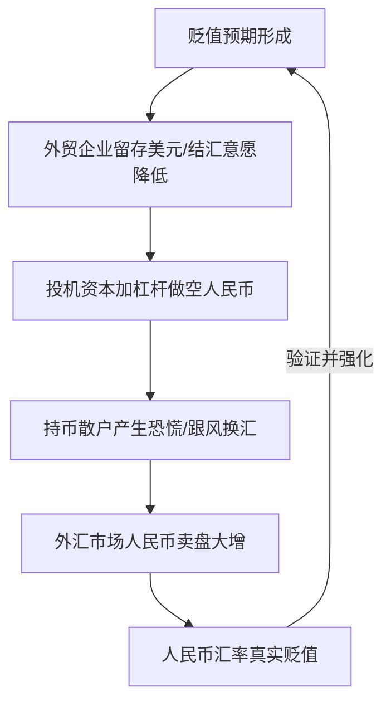
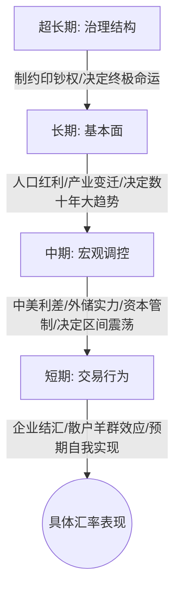

# 人民币汇率涨跌逻辑

## 1. 核心概念与定义 (Core Concepts)

为了用最直观的逻辑理清外汇市场，引入了 **"币圈项目化"** 的对比分析框架，将主权货币视作代币（Token），将央行视作项目方/做市商。

*   **蒙代尔不可能三角 (Mundell's Impossible Trinity)**：
    一国在宏观经济管理中，以下三个目标无法同时实现，最多只能三选其二：
    $$\text{货币政策独立性} + \text{汇率稳定性} + \text{资本自由流动性} \le 2$$
    *   **币圈对照版**：项目方控制代币释放（代币控制权） + 币价稳定不崩盘（价格稳定） + 用户自由提币交易（自由充提）无法同时满足。人民币项目选择了**控制代币释放**和**价格稳定**，牺牲了**自由充提（资本管制）**。
*   **人口红利与"人矿"生命周期 (Demographic Dividend & Life Cycle of Resources)**：
    将劳动力资源类比为自然矿产。
    *   **富矿**：年轻劳动人口充足，抚养比低，生产效率高，社会成本低。
    *   **贫矿**：中年劳动人口，效率下降，成本上升。
    *   **废矿**：老年人口，不参与生产，需要极高的养老和医疗社会治理成本。
*   **盘圈三属性 (Three Attributes of Scheme Models)**：
    *   **产品盘**：靠实体产品销售（出口顺差）获取外界资金流入。
    *   **分红盘**：靠利息/收益率（利差）吸引资金滞留。
    *   **拆分盘**：在主体系内衍生出子板块（如楼市、股市），用高投机效应锁定内部流动性。

---

## 2. 核心内容详细拆解 (Detailed Breakdown)

### 2.1 超长期维度：治理结构与印钞权的制度制约

超长期决定货币的**终极命运**。其核心逻辑在于：**发行权是否受到实质性制度制约**。

#### 1) 传导机制与因果关系
$$\text{印钞权缺乏制约} \longrightarrow \text{财政赤字压力} \longrightarrow \text{无节制增发货币} \longrightarrow \text{信用彻底耗尽} \longrightarrow \text{货币归零}$$

#### 2) 美元与崩盘货币的对比
*   **美元的制约机制**：美联储的印钞权受到国会监督、市场盯盘、媒体舆论及不同利益集团的相互制衡。
    *   *数据佐证*：从1960年到2024年，美国GDP增长54倍，而M2（广义货币供应量）增长了68倍，60余年间货币超发比例仅约 $\frac{1}{4}$。
*   **崩盘货币的共同剧本**：委内瑞拉玻利瓦尔、津巴布韦元等，其政府在面临财政困境时，唯一的手段是无限度印钞，最终导致恶性通胀。

#### 3) 历史经典案例分析
*   **宋代交子与会子**：起初为民间信用创新（锚定铜钱），国家收归垄断后，因长年战争和官僚膨胀，纸币沦为弥补财政赤字的工具，最终信用耗尽归零。
*   **大明宝钞**：作为无准备金、不许兑换金银的"纯行政强制法币"，在朝廷财政吃紧时被无限度增发，导致民间通过使用白银实物或以物易物进行自救，官方管制与民间逃离形成恶性循环，宝钞名存实亡。
*   **近代金圆券**：国民政府试图通过货币重置挽救崩溃的法币，但在军事失败和财政枯竭背景下，金本位承诺无法兑现。强制没收金银、限制兑换等行政手段摧毁了最后的市场信任，导致金圆券在极短时间内变为废纸。
*   **苏联卢布**：在计划经济体制下，卢布并非供求定价，而是记账工具。长期的军备竞赛、低效运转使财政赤字在体制内被行政冻结。20世纪90年代价格一放开，长期压抑的通胀瞬间释放，卢布对美元贬值数十万倍。**"不是市场化毁了卢布，而是失去权力支撑后的必然清算。"**

---

### 2.2 长期维度：基本面与人口结构红利

长期决定货币数十年的**大趋势**。人民币过去几十年的成功，本质上是"人矿"红利的集中开采。

#### 1) 过去二十年的成功逻辑（"放水养鱼"）
*   **策略**：项目方采取了相对克制的货币和财政政策，做大蛋糕。
*   **双赢的非均衡结构**：中国通过压低汇率获得出口竞争优势，快速吸收农村劳动力并完成产业积累；欧美发达国家则通过廉价商品压低了本国通胀，提升了居民购买力。

#### 2) 人口结构逆转对人民币的长期压力机制
$$\text{人口老龄化（富矿转废矿）} \longrightarrow \text{劳动力成本上升} \longrightarrow \text{制造业向越南、印度转移} \longrightarrow \text{贸易顺差见顶下滑}$$

$$\text{人口结构逆转} \longrightarrow \text{购房需求萎缩} \longrightarrow \text{土地财政崩盘} \longrightarrow \text{地方债务压力加剧} \longrightarrow \text{财政赤字爆发} \longrightarrow \text{印钞/加税} \longrightarrow \text{货币贬值}$$

#### 3) 长期趋势的两种演变路径
*   **路径 A（若政策不当）**：对资本和企业不友好 $\rightarrow$ 资本外流、人才流失 $\rightarrow$ 负循环开启 $\rightarrow$ 长期看衰。
*   **路径 B（若政策纠偏）**：重回改革开放、尊重市场与企业家 $\rightarrow$ 转折期可延缓维持10年左右 $\rightarrow$ **2035年后**人口结构问题全面显现，形成不可避免的贬值压力。
*   **日本经验的启示**：日本在"失去的三十年"中，GDP停滞，但日元汇率相对稳定，被称为避险货币。原因在于日本在此期间的M2仅增长了80%（同期美元M2翻了5.5倍）。**"如果政府克制、守住财政纪律不滥发，即使经济不增长，币值（购买力）也不会被洗劫。"**

---

### 2.3 中期维度：利差、外汇储备与做市商控盘

中期决定未来几年的**区间震荡幅度**。

#### 1) 核心基本面支持
中国目前仍拥有天量的贸易顺差，外汇储备充足。作为"大做市商"的央行资金充裕，因此中期内人民币不存在系统性崩溃或断崖式下跌的风险。

#### 2) 中美利差传导机制
$$\text{美联储加息} \longrightarrow \text{美债收益率上升} \longrightarrow \text{中美利差扩大} \longrightarrow \text{资本流向美元资产（套利）} \longrightarrow \text{人民币贬值压力}$$

#### 3) 做市商（央行）的中期操作逻辑
*   **核心目标：维稳而非拉盘**（把汇率控制在合理区间内震荡）。
    *   *不希望过分升值*：升值会打击出口企业，损害经济和就业。
    *   *不希望过分贬值*：过快贬值会引发恐慌性资本外逃，破坏市场信心。
*   **管制与寻租**：利用个人每年5万美元的结汇额度（提币限制）和资本管制，阻止资金无限制外流。这导致了制度化寻租（如QDII额度、部分国企换汇便利等）的产生。

---

### 2.4 短期维度：交易行为与预期的自我实现

短期决定几周到几个月的**波段起伏**。其本质是**市场预期的自我实现**。

*   **外贸企业行为**：取消强制结汇后，企业倾向于在人民币贬值时囤积美元，在人民币升值时集中结汇，客观上加剧了波段振幅。
*   **投机资本与杠杆**：投机者利用外汇市场的高杠杆（10倍~20倍），顺势追涨杀跌，放大短期波动。
*   **散户羊群效应**：由于人数庞大且行为同质化，在贬值趋势中极易形成恐慌性换汇，加速汇率探底。

---

## 3. 逻辑脑图提炼 (Mindmap & Summary)

### 3.1 四层嵌套框架脑图 (Mermaid)

### 3.2 人民币项目的"三盘"属性拆解

| 属性维度 | 对应人民币资产/现象 | 核心观察指标 | 运行与风险逻辑 |
| :--- | :--- | :--- | :--- |
| **产品盘** (靠出口起步) | 外贸出口、制造业产业链 | **出口额与贸易顺差** | 卖得出去才能持续带来外汇流入（动销好）。若顺差收窄，项目失血。 |
| **分红盘** (靠利息吸引) | 中美存款利息、债券收益率 | **中美利差 ($\Delta r$)** | 利差过大（美元高、人民币低）时，资金会流向高收益池。 |
| **拆分盘** (内部子项目) | 房地产、A股、创投市场 | **拆分速度与赚钱效应** | 通过制造楼市、股市等子盘吸引人民币资金留在境内。若子盘全面熄火且无新盘，资金面临流出压力。 |

### 3.3 核心金句

> "超长期的价值，最终取决于发行权是不是受到制度约束，而不是国家规模、意识形态或者是叙事能力。"

> "央行中期的操作逻辑，不是拉盘，而是维稳。央行要在下跌趋势完全走出来之前，提前打断市场的负反馈循环，维持震荡预期。"

> "能够收获日本人（失去三十年但购买力未被洗劫）的结局，中国普通人做梦都能笑醒。"

---

## 4. 针对不同周期的行动指南 (Actionable Advice)

*   **超长期博弈者（关注代际财富安全与传承）**：
    *   人民币及其定价资产（如国内房产）不适合作为超长期配置。
    *   应逐步配置到**治理结构更具制度保障**的硬通货货币和离岸资产中。
*   **长期博弈者（关注未来养老及资产保值）**：
    *   在政策窗口期内（趁换汇管道未完全卡死），效仿日本当年的"渡边太太"，**分批、持续地将部分资产转换为海外资产**。
*   **中期博弈者（国内中小企业主、外贸商家）**：
    *   无需过度恐慌于"中国立刻崩溃"的极端言论，应严格按照央行给出的**区间指导价**进行波段操作。
    *   **理性策略**：汇率靠近区间上沿（人民币贬值到低位）时保留美元、用人民币贷款满足流动性；靠近区间下沿（人民币升值到高位）时积极结汇。避免跟随散户在顶点恐慌换汇。
