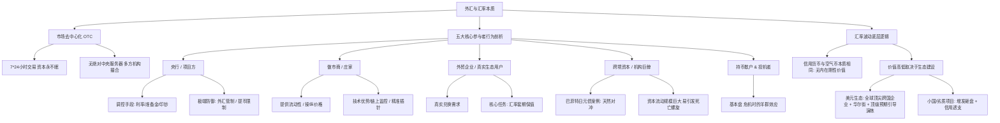

# 从加密货币视角看外汇

# 核心概念与定义 (Core Concepts)

为了建立后续分析的底层逻辑，首先定义外汇市场中的核心概念，并将其与加密货币市场进行等价类比：

*   **终极价值储藏 (Ultimate Store of Value)**：在法币信用体系动荡或地缘政治危机时，不依赖任何单一国家信用、具备去中心化与总量刚性特征的避险资产（如：**黄金** $\approx$ **比特币**）。
*   **本位交易媒介 (Standard Medium of Exchange)**：在全球贸易与资产结算中占据绝对统治地位、作为其他资产计价单位的基准货币（如：**美元** $\approx$ **USDT**等美元稳定币）。
*   **去中心化市场 (Decentralized Market / OTC)**：没有单一物理实体交易所垄断、通过全球成千上万家银行、投行及经纪商网络进行 7×24 小时即时撮合的无国界场外市场。
*   **外汇管制 (Foreign Exchange Control)**：政府为防止资本无序外逃、维护汇率稳定，对本国公民及企业的外汇兑换、出境额度及流向进行的行政干预。
    *   *传导机制*：限制兑换额度/提高审批门槛 $\rightarrow$ 锁死系统流动性 $\rightarrow$ 强行稳住外汇储备与汇率（代价：损害长期信用与市场开放性）。
*   **做市商 (Market Maker)**：在外汇市场中持续提供双边报价（买入价/卖出价）、赚取买卖价差（Spread）并维持市场流动性的金融巨头（如传统外汇巨头 JPMorgan、Citi，以及加密货币做市商 Wintermute、Jump Trading）。
*   **外汇对冲 (FX Hedging)**：企业或投资机构通过远期外汇合约（Forwards）、货币互换（Swaps）等衍生工具，锁定未来兑换汇率，以规避本币与外币汇率波动风险的行为。

---

# 核心内容详细拆解 (Detailed Breakdown)

## 一、 传统外汇与加密货币的体系对照

外汇市场并非神秘莫测的庞大棋局，其运行规律与近年来快速演进的加密货币（币圈）逻辑高度同构：

| 传统外汇概念 (Traditional FX)  | 加密货币等价物 (Crypto Equivalents)       | 特征与功能定位                              |
| :----------------------- | :--------------------------------- | :----------------------------------- |
| **黄金 (Gold)**            | **比特币 (BTC)**                      | 去中心化、总量有限、法币危机时的终极避险资产。              |
| **美元 (USD)**             | **稳定币 (USDT/USDC)**                | 最活跃的交易媒介，全球资产计价单位。背后的"足额储备"常具不透明性。   |
| **大国法币 (EUR, JPY, GBP)** | **主流公链代币 (ETH, BNB, SOL)**         | 具备实际生态、真实用户、大量基本面支撑，有波动但归零风险极低。      |
| **新兴市场货币 (Lira, Real)**  | **中小项目代币 (Altcoins)**              | 市值中等，基本面尚可，但波动极大，易受市场情绪和资本流动影响。      |
| **恶性通胀币 (津巴布韦币, 玻利瓦尔)**  | **土狗/空气币 (Memecoins / Rug Pulls)** | 项目方无限增发导致信用破产，价值迅速归零（如 $LUNA$ 死亡螺旋）。 |

---

## 二、 外汇市场参与者行为学拆解

### 1. 发币主体：政府与中央银行（角色：项目方）
央行在货币市场中拥有极高的主导权，其宏观调控手段在本质上与加密货币项目方的"代币经济学（Tokenomics）"运营高度一致：
*   **政策工具的等价性**：
    *   印钱 / 回收流动性 $\approx$ 增发 / 销毁代币
    *   调整基准利率 $\approx$ 调整 Staking（质押）收益率
    *   外汇储备干预 $\approx$ 项目方回购平抑币价
*   **典型案例：土耳其里拉（Failed Project Team）**
    *   *决策错误*：总统埃尔多安强行维持低利率。
    *   *因果传导*：强行降息 $\rightarrow$ 实际利率为负 $\rightarrow$ 资本疯狂抛售里拉 $\rightarrow$ 里拉在4年内对美元贬值近 80%。
    *   *话术一致性*：将其定义为"经济独立战争"，将暴跌归咎于"外部势力打压"。
*   **外汇管制与提币限制**：
    *   当面临资本外流（如2015年中国股市波动、外储骤降）时，政府实施外汇管制。
    *   这等同于交易平台暂停提币（Withdrawal Limit）或加强 KYC 审核。
    *   *双刃剑效应*：短期内固然能截断资金流出、稳住汇率，但长期会削弱外资和本土资本的信任。

### 2. 市场主宰者：做市商（角色：控盘庄家）
在全球外汇市场中，排名前十的做市商（摩根大通、花旗、德意志银行等）垄断了超过 $1/3$ 的交易量。

```
[传统做市商] vs [加密货币做市商]
  │
  ├─ 1. 透明度差异：
  │    ├─ 传统：受合规部门与监管（SEC/CFTC）盯着（虽然历史上曾有操纵案，如2014年交易员"黑手党"案）。
  │    └─ 加密：多为黑箱操作，通过内幕消息、提前套现等方式生存。
  │
  ├─ 2. 技术与信息优势：
  │    ├─ 传统：高频、算法交易。
  │    └─ 加密：链上数据全透明。做市商与交易所利益勾兑，精准获取大户清算线、止损单，进行"插针"定点爆破。
  │
  └─ 3. 风险偏好差异：
       ├─ 传统：赚取微小买卖价差（如 0.0001%），靠海量规模获利，风控极严。
       └─ 加密：波动极大（日均 10% 以上），做市商风控偏好极高（如 FTX、三箭资本因风控失效爆雷）。
```

### 3. 商品贸易实体：外贸企业（角色：真实链上用户）
*   **核心痛点**：跨国贸易中存在巨大的外汇敞口。
*   **对冲逻辑**：为避免在生产/销售周期中因汇率剧烈波动而吃掉利润，必须通过衍生品进行套期保值。
*   **加密企业对照**：链游或 Web3 协议接收各种代币（ETH/SOL），但运营开支（工资、服务器）多为美元，若不及时做币币对冲，在熊市中购买力将迅速缩水（如 2017-2018 年大量 ICO 项目因未将筹集的 ETH 及时变现对冲而倒闭）。

### 4. 资本市场搬运工：跨境资本（角色：巨鲸/机构投资人）
跨境资本流动速度极快、规模极大，其进出直接左右一国的短期汇率走势。

#### 经典避险与对冲案例：巴菲特投资日本五大商社
若美国投资者直接使用美元兑换日元（当时汇率为 $106$），在日元大幅贬值（至 $150$）的背景下，即便日本股市上涨 $100\%$，换回美元后的真实收益也会被汇率严重侵蚀：

*   **常规投资路径（无汇率对冲）**：
    $$\text{初始资本} = 1,000,000 \text{ USD} \xrightarrow{\text{汇率 } 106} 106,000,000 \text{ JPY}$$
    $$\text{股市翻倍} \rightarrow 212,000,000 \text{ JPY} \xrightarrow{\text{贬值汇率 } 150} 1,413,333 \text{ USD}$$
    $$\text{真实美元收益率} \approx 41.3\% \quad (\text{远低于股市的 } 100\% \text{ 涨幅})$$

*   **巴菲特的套利路径（完美汇率对冲）**：
    $$\text{在日本低息发行日元债} \rightarrow \text{直接筹集日元} \rightarrow \text{购买日元股票}$$
    由于借入日元、投资日元、未来还款也是日元，**汇率变动对巴菲特的最终美元收益完全不产生影响**，同时还锁定了日本极低的利息成本（约 $0.5\%$）。

---

## 三、 汇率波动机制：正反馈与死亡螺旋

无论法币还是加密货币，其汇率/币价变化的底层机制源于"Reflexivity（反身性）"，容易在市场预期下形成循环：

### 1. 繁荣期的正反馈机制
$$\text{经济/生态火热} \rightarrow \text{外资/热钱流入} \rightarrow \text{换汇需求激增} \rightarrow \text{汇率/币价上涨} \rightarrow \text{赚取双重收益预期的资本进一步涌入}$$

### 2. 衰退期的死亡螺旋（Death Spiral）
$$\text{市场信心受挫} \rightarrow \text{资本开始恐慌撤离} \rightarrow \text{抛售本币/代币换回外币/美元} \rightarrow \text{汇率急速下跌} \rightarrow \text{触发更大规模资本外逃}$$
*   *历史实证*：1997年亚洲金融危机（泰铢、韩元闪崩 $50\% - 70\%$）；2018年加密货币 ICO 泡沫破裂（项目方竞相抛售 ETH 导致币价踩踏）。

---

# 逻辑脑图提炼 (Mindmap & Summary)

## 1. 核心逻辑架构



---

## 2. 核心摘录

> "黄金等于比特币……美元等于以USDT为代表的稳定币……各国货币等于各种项目代币。"

> "外汇管制，本质上就是不让你跑，把你锁在系统里，短期有效，但长期会损害信用，会损害开放性。"

> "无论是币圈项目方发的TOKEN，还是国家发的信用货币，它本身有内在价值吗？没有……那为什么有的空气值钱，有的空气一文不值？全看发币的那个项目方怎么做事，怎么搞生态。"
