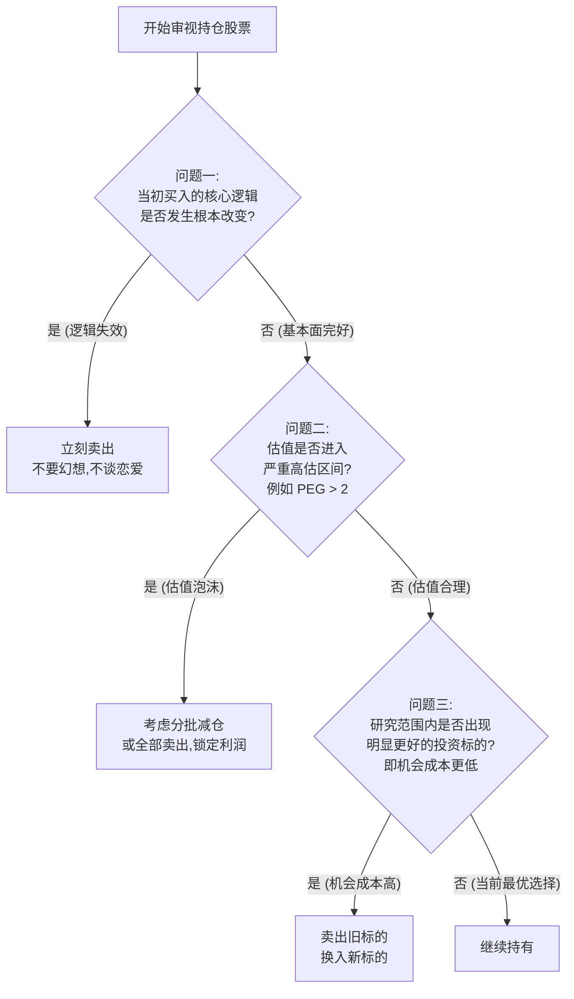

# 股票的卖点

## 1. 核心概念与定义 (Core Concepts)

*   **资产管理规模 (AUM - Assets Under Management)**：指金融机构实际控制和运营的资产总额。这是金融机构收取管理费和维持运转的生命线。
*   **退出权 (Exit Right)**：二级市场小股东最核心的权利。在无法参与公司治理、信息极度不对称的处境下，小股东通过在交易所卖出股票来保护自身资产的终极自由。
*   **安全边际 (Margin of Safety)**：由本杰明·格雷厄姆提出，指资产内在价值与市场价格之间的差额。当价格远低于价值时，即存在安全边际；反之，若高估则转化为**危险边际**。
*   **损失厌恶 (Loss Aversion)**：行为金融学概念，指人类面对同样数量的收益和损失时，认为损失更加令其痛苦（通常痛苦感是快乐感的2-2.5倍）。
*   **认知失调 (Cognitive Dissonance)**：当个体的行为（如投资亏损）与其自我认知（如"我是聪明的投资人"）发生冲突时，内心产生的极度不适感。个体往往会通过改变信念（如将套牢包装为"长期主义"）来消除这种失调。
*   **PEG指标 (Price/Earnings-to-Growth Ratio)**：
    $$PEG = \frac{PE}{G}$$
    *其中 $PE$ 为市盈率，$G$ 为企业预期盈利增长率。该指标用以评估股票估值是否与成长性相匹配。*

---

## 2. 核心内容详细拆解 (Detailed Breakdown)

### 一、 金融行业的四大潜规则：为什么大师在公开场合对"卖出"闭口不谈？

大师们在实际操作中频繁卖出，但在公开宣传中仅强调买入，背后的深层逻辑可归结为金融业的四条生存法则：

```
[大资本体量公开唱空] ➔ [引发市场恐慌与流动性枯竭] ➔ [自身巨量持仓无法变现]
```

#### 1. 利益共同体：绝不砸整个行业的饭碗
*   **商业模式本质**：基金公司、券商和交易所的收益基于"资产留在市场中"（赚取管理费和交易手续费）。
*   **行为逻辑**：鼓吹"长期持有"和"永不卖出"，本质上是构建一种宏大叙事，确保散户的资金能够源源不断且长期留在牌桌上。

```
       /\
      / 1\   投资大师
     /----\
    /  2   \ 投行/基金/交易所
   /--------\
  /    3     \ 投资者资金
 /------------\
/      4       \ 资产管理规模 (AUM)
----------------
```
**绝不砸行业的饭碗** —— 整个金融行业的利益，牢牢捆绑在一起
#### 2. 生存策略：为聪明钱的出逃确保流动性
*   **流动性陷阱**：大资金（如巴菲特管理资金）在离场时面临巨大的市场冲击成本。如果公开宣称看空，市场流动性会瞬间枯竭。
*   **案例分析**：
    *   **巴菲特减持中石油（2007年）**：故意采用平信邮寄减持报告的方式递交港交所，利用邮寄的时间差，隐秘而缓慢地出货，为自己争取宝贵的逃顶流动性。
    *   **高瓴资本张磊**：公开大力倡导"长期主义"和"做时间的朋友"，但在政策风向变化前，迅速且果断地清仓了全部教育股。

#### 3. 声誉枷锁：看多与看空的风险收益极不对等
*   **不对称性**：
    *   *看多*：预测错误代价极低（熊市中无人关注），一旦预测成功则可被奉为"股神"。
    *   *看空*：预测错误会沦为市场各方攻击的靶子（如巴菲特因看空比特币遭币圈长期嘲讽）；预测正确也不会换来市场的感激。
*   **公开认错成本高**：割肉离场等于向公众承认判断失误（如巴菲特割肉航空公司），为避免股价踩踏与声誉受损，悄悄卖出是唯一的理性选择。

#### 4. 人性对抗：避免与公众情绪直接冲突
*   **利益冲突**：公开看空具体股票，等于直接得罪该股票的所有持有者；公开唱空大盘，则等于与整个市场及公众情绪为敌。

---

### 二、 逻辑与经验的双重去魅

#### 1. 逻辑层面的自相矛盾
*   **投资循环未闭环**：投资的根本目的是资产增值并最终变现。不卖出的资产只是账面数字。
    $$\text{完整投资循环} = \text{低估买入} \rightarrow \text{价值成长/重估} \rightarrow \text{高估卖出变现}$$
*   **拒绝资本的重新分配**：不卖出意味着无法将资金从高估值/泡沫资产中抽离，投入到高性价比的新机会中，降低了资本的利用效率。

#### 2. 经验层面的事实违背
在现实的投资历史中，没有任何一位大师是"买入后永远不卖"的：
*   **彼得·林奇**：强调"拔掉杂草，浇灌鲜花"，通过动态调整投资组合闻名。
*   **查理·芒格**：曾坦率承认在阿里巴巴上的投资错误，并果断割肉离场。
*   **温斯顿·巴菲特**：清仓航空公司（2020年）、系统性减持富国银行、卖出IBM转换至苹果。**大师持有的前提是"买入逻辑依然成立"，而非为了持有而持有。**

---

### 三、 "永不卖出"神话的理论误区与心理根源

#### 1. 理论根源的曲解与念歪
*   **误区一：曲解巴菲特的"十年持有"原则**
    *   *本质*：是指**长期的思考模式**（着眼于企业10-20年的竞争优势），而非机械地拒绝交易。
    *   *原则*：投资者应当忠诚于自己的**投资原则**（如安全边际、护城河），而非特定的**股票代码**。
*   **误区二：无脑定投"只买不卖"的悖论**
    *   *悖论*：如果确信资产未来必然产生巨大回报，最理性的行为应是当下一次性梭哈买入，而非通过定投拉长建仓时间。定投行为本身即意味着对未来的不确定。
    *   *正确操作*：低估加倍定投 $\rightarrow$ 合理估值坚持定投 $\rightarrow$ 高估暂停买入 $\rightarrow$ 泡沫阶段分批卖出。
*   **误区三：二级市场散户的"股权思维"幻觉**
    *   散户并非真正的"企业主"，两者处境差异极大：
        $$\text{小股东三大劣势} = \text{毫无控制权} + \text{信息极度不对称} + \text{极其有限的分红权}$$
    *   因此，**退出权（即用脚投票的自由）** 是小股东唯一能够自卫的终极权利。

#### 2. 心理根源：强效避风港
*   **损失厌恶的逃避**：账面浮亏转化为实亏极其痛苦，"永不卖出"给投资者提供了延迟面对痛苦的借口。
*   **消除认知失调**：将"投资失败被套牢"强行解释为"在做时间的朋友"、"进行战略性持有"，实现心理上的自我安慰。
*   **部落身份认同**：网络社区利用"钻石手 (Diamond Hands)"等黑话对坚持不卖的人授予荣誉，而将理性退出者打上"纸手 (Paper Hands)"的叛徒标签。

---

### 四、 终极风险：无视退出机制的代价

*   **流动性黑天鹅**：在极端市场危机或闪崩中，流动性会瞬间枯竭，交易熔断，挂单无法成交，"不想卖"会瞬间变为"无法卖"。
*   **系统性与制度性风险**：
    *   历史证明游戏的底层规则是会改变的。如1949年前的旧上海证券交易所，关停后老股票全部归零。
    *   相信单一资产或市场永远上涨，是对历史规律与系统性风险缺乏敬畏的表现。

---

## 3. 逻辑脑图提炼 (Mindmap & Summary)

### 投资组合卖出决策树 (Peter Lynch's Decision Tree)

以下是融合了格雷厄姆、巴菲特与彼得·林奇智慧的卖出决策模型。



### 核心结论

> 1. **利益本质**："永不卖出这句话本质是说给散户听的，它真实的目的是为了给聪明钱自己要卖出的时候，提供充足的、源源不断的接盘流动性。"
> 2. **退出权利**："二级市场小股东最核心的权利，不是那点少得可怜的分红权，而是把你手里这张股票卖给下一个人的权利。你最终极的权利、最后的自由，就是你的退出权。"
> 3. **理性真谛**："真正成功的长期投资，不是关于被动的死扛到底，它是关于耐心、关于纪律，但归根到底，它是关于理性。而理性的核心要求，就是对你所持有的每一项资产进行持续的、动态的、诚实的评估。"
> 4. **终极隐喻**：投资如同《三体》中的星舰黑暗战役，必须像"蓝色空间号"一样，主动打破旧的伦理道德（大大众媒体和部落灌输的投资教条），提前抽干舰内空气、穿上宇航服适应残酷真空（做好随时退出、斩仓和防范系统性风险的准备），才能避免遭受黑暗森林打击。
